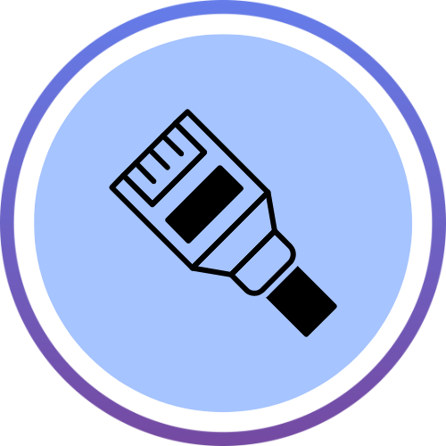
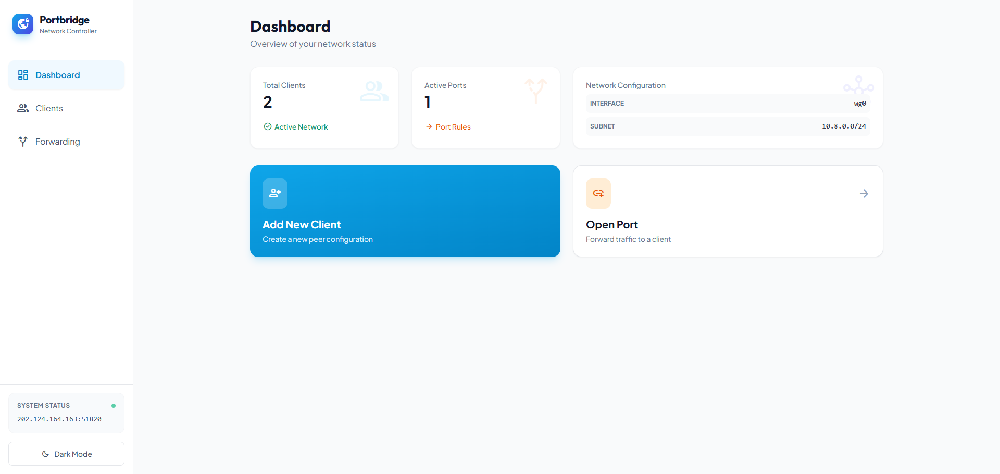
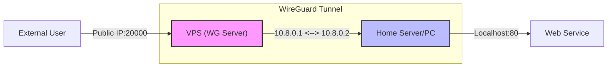
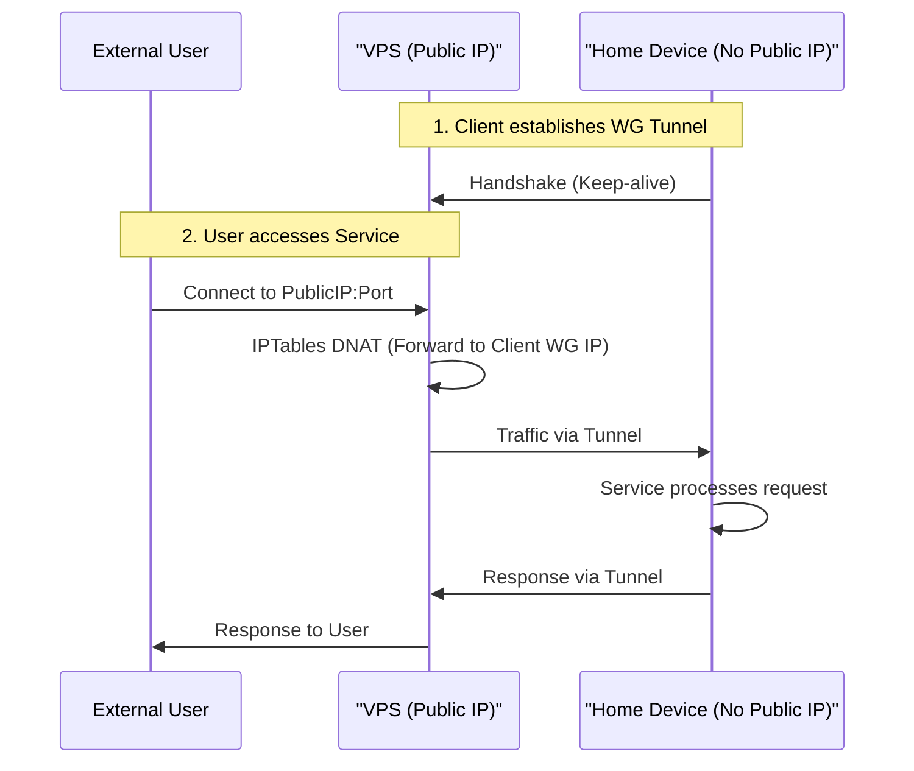
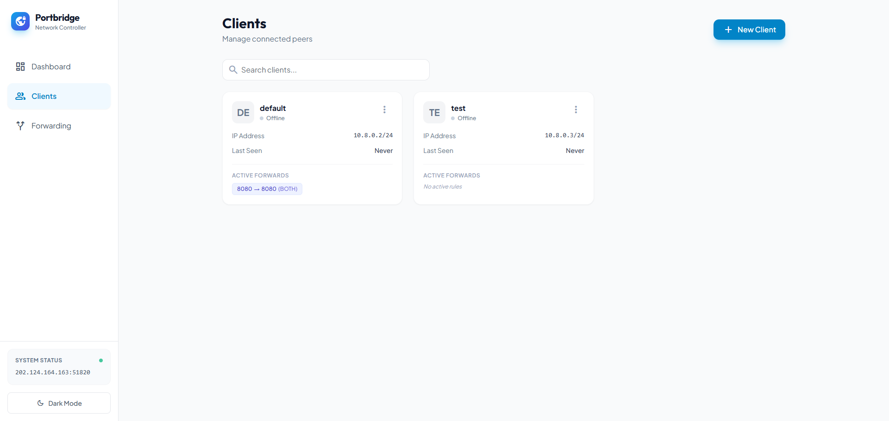
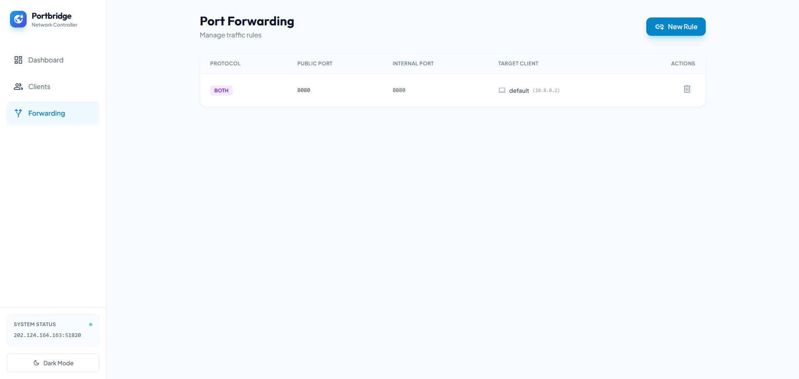

<div align="center">
  

  # PortBridge

A professional, lightweight, and user-friendly solution for managing WireGuard peers and port forwarding rules. Designed to easily expose services running behind NAT (like home routers or private networks) through a public VPS, without needing a public IP at the source.

  <div>
    <a href="https://hub.docker.com/r/lahiru98s/portbridge "></a>
    <a href="https://github.com/nooblk-98/lighthouse/releases"></a>
    <a href="https://github.com/nooblk-98/lighthouse/actions/workflows/docker-build-push.yml"></a>
     <a href="https://creativecommons.org/licenses/by-nc/2.0/">
    
  </div>
</div>

---



## 🚀 Key Features

*   **Easy Peer Management**: Create, delete, and manage WireGuard clients with a few clicks.
*   **QR Code Support**: Instantly generate QR codes for mobile client configuration.
*   **Dynamic Port Forwarding**: Forward TCP/UDP ports from your public server to any connected client.
*   **Port Range Support**: Forward entire ranges of ports (e.g., `8000-8100`) for games and complex apps.
*   **Source IP Whitelisting**: Restrict access to forwarded ports to specific IP addresses for enhanced security.
*   **Real-time Monitoring**: View client online status, handshake times, and **bandwidth usage (RX/TX)**.
*   **Secure Dashboard**: Built-in authentication to protect your management UI.
*   **Dark Mode**: Fully supported dark theme for comfortable viewing.
*   **Dockerized**: Runs in a lightweight Alpine container with minimal dependencies.

---

## 🏗️ Architecture & How It Works

This application solves the problem of accessing services hosted on networks without a public IP (e.g., Starlink, CGNAT, or dynamic residential IPs).

### The Concept
You run this application on a **VPS** (Virtual Private Server) that has a Public IP. Your home devices (Clients) connect to this VPS via a WireGuard tunnel. The VPS then acts as a gateway, forwarding traffic from specific public ports through the tunnel to your home devices.

### Traffic Flow Diagram



### Connection Sequence



---

## 🛠️ Deployment Guide

### Prerequisites
*   A VPS with a Public IP (Ubuntu/Debian recommended).
*   Docker and Docker Compose installed.
*   Root access (required for managing network interfaces).

### Deployment Steps

1.  **Configure Environment**:
    Create a `.env` file or modify `docker-compose.yml`:
    ```yaml
    environment:
      - WG_HOST=your.public.ip.address  # IMPORTANT: Your VPS Public IP
      - ADMIN_PASSWORD=secure_password   # Dashboard Login Password (Default: admin)
    ```

2.  **Run the Container**:
    ```bash
    docker-compose up -d --build
    ```

---

## 💻 Client Connection Guide

How to connect your home server or router to the VPS to expose ports.

### Step 1: Create a Client
1.  Open the Web UI (`http://<your-vps-ip>:3000`).
2.  Go to the **Clients** tab.
3.  Click **"New Client"**.
4.  Enter a name (e.g., `Home-Server`) and click **Create**.

### Step 2: Configure the Client Device
1.  **Download Config**: Click the "Download Config" option on the client card to get the `.conf` file.
2.  **Install WireGuard**:
    *   **Linux**: `sudo apt install wireguard`
    *   **Windows/Mac**: Download the official WireGuard client.
3.  **Apply Config**:
    *   **Linux**: Copy the file to `/etc/wireguard/wg0.conf` and run `wg-quick up wg0`.
    *   **GUI Apps**: Import the `.conf` file or scan the QR code.

### Step 3: Verify Connection
Check the Web UI. The client status should turn **Online** (Green) within a few seconds of connecting.

---

## 🔗 Port Forwarding (The Magic)

Now that your client is connected, let's expose a service (e.g., a Minecraft server or Web App) running on your home machine.

1.  **Identify the Service**:
    *   Let's say your Home Server runs a web app on port `8080`.
2.  **Open a Port**:
    *   Go to the **Forwarding** tab in the Web UI.
    *   Click **"New Rule"**.
    *   **Public Port**: `30000` (or a range `30000-30100`).
    *   **Internal Port**: `8080` (The port your service is running on).
    *   **Protocol**: `TCP` (or UDP/Both depending on the service).
    *   **Target Client**: Select `Home-Server`.
    *   **Source IP (Optional)**: Enter an IP `1.2.3.4` to only allow connections from that IP.
    *   Click **Add Rule**.
3.  **Access**:
    *   Anyone can now access your home web app via `http://<VPS-Public-IP>:30000`.

---

## 📸 UI Gallery

<p align="center">
  
</p>
<p align="center">
  <em>Dashboard Overview</em>
</p>
<br/>

<p align="center">
  
</p>
<p align="center">
  <em>Client Management</em>
</p>
<br/>

<p align="center">
  
</p>
<p align="center">
  <em>Port Forwarding Rules</em>
</p>
---

## 🛡️ Security Notes

*   **Firewall**: The application manages `iptables` for forwarding, but ensure your VPS firewall (UFW/Security Groups) allows the ports you want to expose (e.g., 20000, 25565).
*   **Web UI Access**: The Web UI runs on port `3000`. It is protected by a login page (configure `ADMIN_PASSWORD` in docker-compose).

## 🤝 Contributing

Contributions are welcome! Please feel free to submit a Pull Request.

## 📄 License

This project is licensed under the MIT License - see the [LICENSE](LICENSE) file for details.
