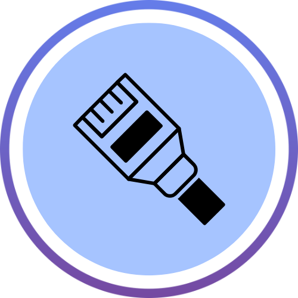
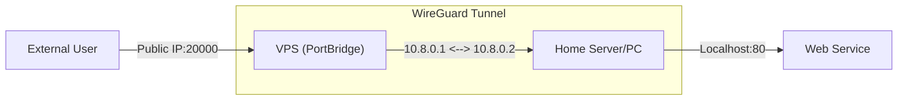
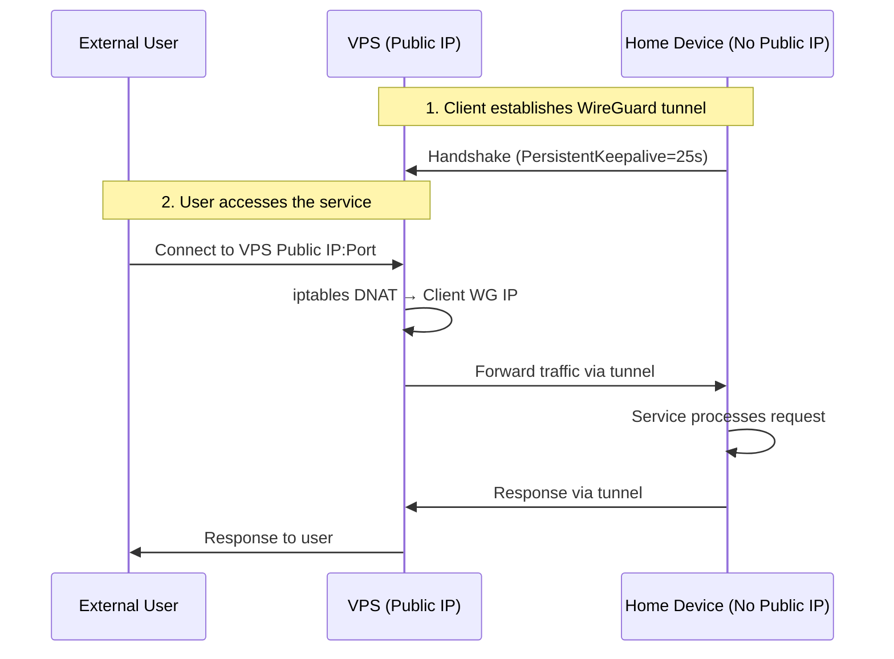
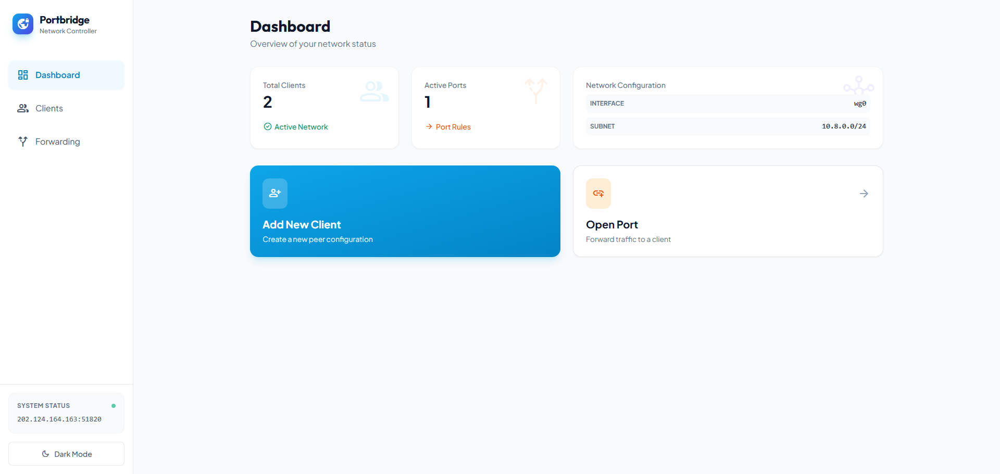
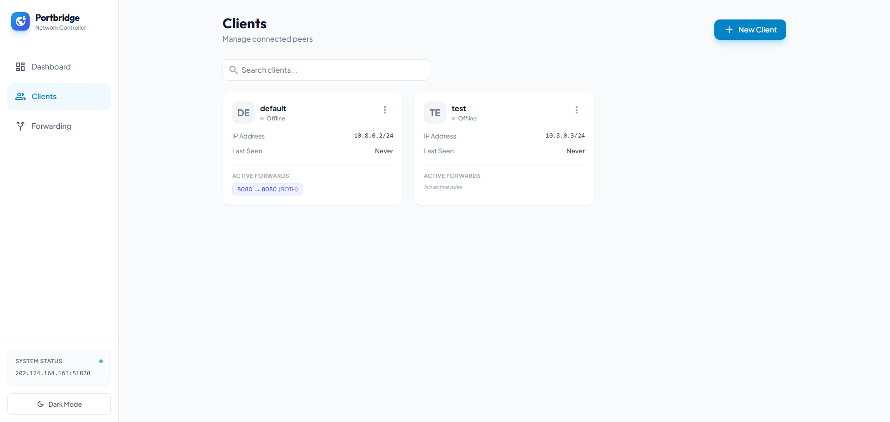
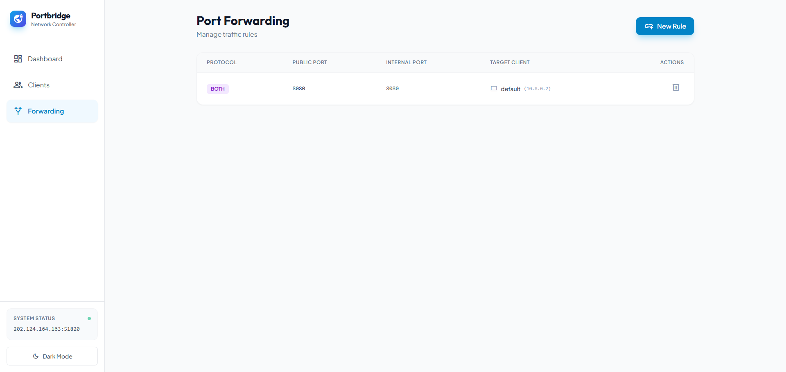

<div align="center">
  

  # PortBridge

  Self-hosted WireGuard VPN manager with a dynamic port forwarding web UI.
  Expose services behind NAT/CGNAT without a public IP.

  <div>
    <a href="https://hub.docker.com/r/lahiru98s/portbridge"></a>
    <a href="https://github.com/nooblk-98/portbridge/releases"></a>
    <a href="https://github.com/nooblk-98/portbridge/actions/workflows/publish.yml"></a>
    
  </div>

  ⭐ If you like this project, star it on GitHub — it helps a lot!

  [Overview](#overview) • [How it works](#how-it-works) • [Features](#features) • [Getting started](#getting-started) • [Usage](#usage) • [Configuration](#configuration) • [Screenshots](#screenshots)

</div>

## Overview

PortBridge is a lightweight, Docker-based tool that lets you expose services running on devices behind NAT, CGNAT, Starlink, or dynamic residential IPs through a public VPS. It combines a WireGuard VPN server with an iptables-based port forwarder, all managed through a clean web UI.

> [!TIP]
> No static public IP needed on the client side. As long as your device can initiate outbound connections, PortBridge can make its services reachable.

## How it works

You run PortBridge on a VPS with a public IP. Client devices connect to it over a WireGuard tunnel. PortBridge forwards traffic from public ports on the VPS through the tunnel to specific services on those devices.


```mermaid
graph LR
    User[External User] -- "Public IP:20000" --> VPS["VPS (PortBridge)"]
    subgraph "WireGuard Tunnel"
    VPS -- "10.8.0.1 <--> 10.8.0.2" --> Client["Home Server/PC"]
    end
    Client -- "Localhost:80" --> Service["Web Service"]
```


```mermaid
sequenceDiagram
    participant User as External User
    participant Server as VPS (Public IP)
    participant Client as Home Device (No Public IP)

    Note over Client, Server: 1. Client establishes WireGuard tunnel
    Client->>Server: Handshake (PersistentKeepalive=25s)

    Note over User, Server: 2. User accesses the service
    User->>Server: Connect to VPS Public IP:Port
    Server->>Server: iptables DNAT → Client WG IP
    Server->>Client: Forward traffic via tunnel
    Client->>Client: Service processes request
    Client->>Server: Response via tunnel
    Server->>User: Response to user
```

## Features

- **WireGuard peer management** — Full CRUD for clients via a clean web UI with online/offline status, handshake times, and bandwidth usage (RX/TX).
- **Dynamic port forwarding** — Forward any TCP/UDP port from the VPS to connected clients. Changes apply in real time via iptables without restarting WireGuard.
- **Port range support** — Forward entire ranges (e.g., `8000-8100`) for gaming servers or multi-port applications.
- **Source IP whitelisting** — Restrict access to forwarded ports by source IP or CIDR for enhanced security.
- **QR code provisioning** — One-click QR code generation for mobile WireGuard client setup.
- **Seamless peer reload** — Uses `wg syncconf` for hot-reloading peers without disconnecting existing clients (falls back to `wg-quick` bounce if needed).
- **Dark mode** — Full dark theme persisted to local storage.
- **Lightweight & Dockerized** — Alpine-based container (~300 MB), minimal Python dependencies (Flask + 3 libraries).
- **Multi-arch images** — Published for both `linux/amd64` and `linux/arm64` on Docker Hub and GitHub Container Registry.

## Getting started

### Prerequisites

- A VPS with a public IP (Ubuntu/Debian recommended)
- Docker and Docker Compose installed
- Root access (required for `NET_ADMIN`, `SYS_MODULE` capabilities, and `iptables`)

### Quick deploy

```bash
wget -O docker-compose.yml https://raw.githubusercontent.com/nooblk-98/portbridge/refs/heads/main/docker-compose.live.yml && docker compose up -d
```

### Manual setup

Create a `docker-compose.yml`:

```yaml
services:
  portbridge:
    image: lahiru98s/portbridge:latest
    container_name: portbridge
    environment:
      WG_HOST: 203.0.113.10         # Required: your VPS public IP
      ADMIN_PASSWORD: changeme       # Required: web UI password
    cap_add:
      - NET_ADMIN
      - SYS_MODULE
    sysctls:
      - net.ipv4.ip_forward=1
      - net.ipv4.conf.all.src_valid_mark=1
    ports:
      - "51820:51820/udp"          # WireGuard
      - "3000:3000/tcp"            # Web UI
      - "30000-30100:30000-30100/tcp"  # Port forwarding range (optional)
    volumes:
      - wg-data:/data
      - /lib/modules:/lib/modules:ro
    restart: unless-stopped

volumes:
  wg-data:
```

Then start the container:

```bash
docker compose up -d
```

> [!IMPORTANT]
> You must set `WG_HOST` to your VPS public IP address for clients to connect. The default `ADMIN_PASSWORD` is `admin` — change it in production.

## Usage

### 1. Create a client

1. Open the web UI at `http://<vps-ip>:3000` and log in.
2. Go to the **Clients** tab and click **New Client**.
3. Enter a name (e.g., `home-server`) and click **Create**.

### 2. Configure the client device

1. Click the download icon on the client card to get the `.conf` file, or view the QR code for mobile setup.
2. Import the config into the [WireGuard client](https://www.wireguard.com/install/) on your device.
3. On Linux: copy the file to `/etc/wireguard/wg0.conf` and run `wg-quick up wg0`.

### 3. Add a port forwarding rule

1. Go to the **Forwarding** tab and click **New Rule**.
2. Specify:
   - **Public port** — the port on your VPS (single port or range, e.g., `30000` or `30000-30100`)
   - **Internal port** — the port your service runs on (e.g., `8080`)
   - **Protocol** — `TCP`, `UDP`, or `Both`
   - **Target client** — select the client from the dropdown
   - **Source IP** (optional) — restrict access to a specific IP or CIDR
3. Click **Add Rule**.

Your service is now accessible at `http://<vps-ip>:30000`.

## Configuration

All configuration is done through environment variables:

| Variable | Default | Description |
|---|---|---|
| `WG_HOST` | `127.0.0.1` | VPS public IP or hostname (required) |
| `WG_PORT` | `51820` | WireGuard listening UDP port |
| `WG_NETWORK` | `10.8.0.0/24` | WireGuard tunnel subnet |
| `WG_ADDRESS` | `10.8.0.1/24` | Server address within the tunnel |
| `WG_INTERFACE` | `wg0` | WireGuard interface name |
| `APP_PORT` | `3000` | Web UI port |
| `ADMIN_PASSWORD` | `admin` | Dashboard login password |
| `DATA_DIR` | `/data` | Persistent data directory |

## Screenshots

<p align="center">
  
  <br/>
  <em>Dashboard overview</em>
</p>

<p align="center">
  
  <br/>
  <em>Client management with online status and bandwidth</em>
</p>

<p align="center">
  
  <br/>
  <em>Port forwarding rules management</em>
</p>

## Security notes

- The web UI is protected by a login page. Change the default `admin` password.
- PortBridge uses custom `iptables` chains (`WG_FORWARDER`) that are isolated from your system rules.
- The WireGuard port (`51820`) and web UI port (`3000`) are reserved and cannot be forwarded through the UI.
- Ensure your VPS firewall (UFW / cloud security groups) allows the ports you intend to expose.
