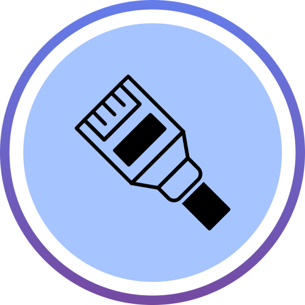

<div align="center">
  

  # PortBridge

  **Reach devices behind NAT or CGNAT through a WireGuard server you control.**

  [](https://github.com/nooblk-98/portbridge/releases)
  [](https://hub.docker.com/r/lahiru98s/portbridge)
  [](LICENSE)
</div>

PortBridge is a single Rust binary that pairs a WireGuard VPN server with iptables port forwarding, managed from a web dashboard. Run it on a public VPS to expose services from home labs, Starlink or other connections that cannot accept inbound traffic.

- **Private access**: share a host or subnet with other peers over WireGuard, with per-route access control.
- **Public forwarding**: publish a TCP or UDP port on the server and send it to a service on a peer, with optional source IP restrictions.
- **Easy onboarding**: create peers in the UI, then download the config or scan a QR code.
- **Hardened by default**: peer internet egress is blocked unless you enable it, and the dashboard listens on localhost.

## Quick start

You need a server with a public IP or DNS name, and UDP 51820 allowed through its firewall and your provider's.

### Docker Compose

Create a `.env` file with your server's address and a strong dashboard password:

```ini
WG_HOST=vpn.example.com
ADMIN_PASSWORD=change-me-to-a-long-password
```

Then start the [published image](docker-compose-live.yml):

```sh
docker compose -f docker-compose-live.yml up -d
```

To build from a local checkout instead, run `docker compose up -d --build`.

> [!NOTE]
> The dashboard is bound to `127.0.0.1:3000` on the server. Reach it from your computer with an SSH tunnel:
>
> ```sh
> ssh -N -L 3000:127.0.0.1:3000 user@vpn.example.com
> ```
>
> Then open <http://localhost:3000>.

### Debian or Ubuntu (no Docker)

Requires systemd and sudo. Run the installer with your server's public hostname or IP in place of `vpn.example.com`. It downloads the latest release for your architecture (`x86_64` or `arm64`), verifies its SHA-256 checksum, and prompts for a dashboard password. No Rust toolchain is needed.

```sh
curl -fsSL https://raw.githubusercontent.com/nooblk-98/portbridge/main/install.sh | sudo bash -s -- vpn.example.com
```

With `wget`:

```sh
wget -qO- https://raw.githubusercontent.com/nooblk-98/portbridge/main/install.sh | sudo bash -s -- vpn.example.com
```

To pin a version, set `PORTBRIDGE_VERSION` on the `sudo` side, for example `| sudo PORTBRIDGE_VERSION=v1.0.0 bash -s -- vpn.example.com`.

The installer prompts for a dashboard password (16–128 letters or numbers), creates the `pb0` WireGuard interface, stores data in `/var/lib/portbridge`, and starts the `portbridge` service. Use the SSH tunnel above to reach the dashboard.

```sh
sudo systemctl status portbridge
sudo journalctl -u portbridge -e
```

<details>
<summary>Build from source</summary>

Install `build-essential` and Rust 1.85 or newer, then:

```sh
git clone https://github.com/nooblk-98/portbridge.git
cd portbridge
cargo build --release --locked --bin portbridge
sudo PORTBRIDGE_BINARY="$PWD/target/release/portbridge" bash install.sh vpn.example.com
```

</details>

## Usage

### Connect a device

1. Sign in and create a peer under **Clients**.
2. Download its WireGuard configuration or scan the QR code with the [WireGuard app](https://www.wireguard.com/install/).
3. Activate the tunnel and check **Clients** for a recent handshake.

### Share a host or subnet privately

1. Open **Clients → Peer settings** for the device that owns or can reach the host.
2. Enter an IPv4 address (`192.168.50.10`) or CIDR (`192.168.50.0/24`) and save.
3. If the destination sits behind that device, enable IP forwarding on it, allow forwarding in its firewall, and add a return route to the WireGuard subnet (or use source NAT).
4. Peers using **Split tunnel** must re-import their updated profile. They can then connect to the destination IP directly.

You can advertise private IPv4 ranges and `100.64.0.0/10`. Routes must be distinct and cannot overlap the VPN subnet or existing server routes. DNS, MTU and keepalive can also be set per peer.

Open **Routes** and select **Edit access** to choose which peers may use a route. An empty selection blocks every other peer.

### Publish a service to the internet

Open **Forwarding**, create a rule, and choose a public port, protocol, target peer and service port. Optionally restrict it to a source IP or CIDR.

The service sees the original client address, so its replies must return through WireGuard. With a split-tunnel profile, add a return route for the permitted sources, or use a full-tunnel profile. Allow the public port through your firewalls, and for Docker add the port to the Compose `ports` list, for example `"30000:30000/tcp"`.

### Internet access through the VPN

Peer internet access is blocked by default. To use the server as a gateway, set `ALLOW_INTERNET_EGRESS=1` in `/etc/portbridge/portbridge.env` (or the Compose service environment) and restart. Devices with full-tunnel profiles will then route IPv4 internet traffic through the server.

## Configuration

PortBridge is configured through environment variables.

| Variable | Default | Description |
| --- | --- | --- |
| `ADMIN_PASSWORD` | required | Dashboard password |
| `WG_HOST` | `127.0.0.1` | Public hostname or IP written into peer configs |
| `WG_PORT` | `51820` | WireGuard UDP port |
| `WG_NETWORK` | `10.8.0.0/24` | VPN subnet |
| `WG_INTERFACE` | `wg0` | WireGuard interface name |
| `APP_HOST` / `APP_PORT` | `0.0.0.0` / `3000` | Dashboard bind address |
| `DATA_DIR` | `/data` | Where keys and state are stored |
| `ALLOW_INTERNET_EGRESS` | unset | Set to `1` to allow peer internet egress |

## Upgrading

Keep the same Compose project name and data volume. If you are upgrading from the earlier Python version, sign in again and recreate legacy public forwards for the intended peers.

## Development

```sh
cargo build
cargo test
```

See [CONTEXT.md](CONTEXT.md) for the domain language and module overview.
